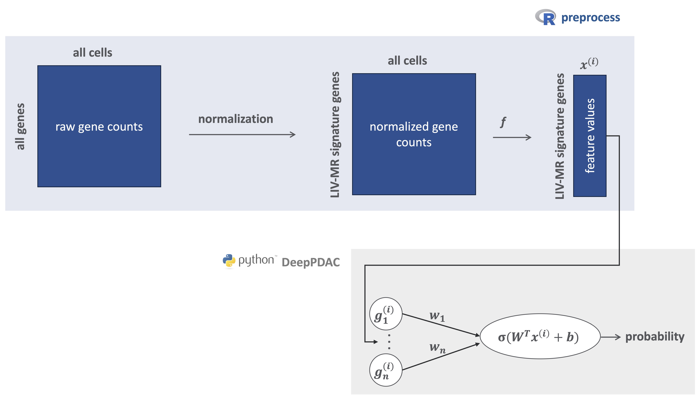

# DeepPDAC
Deep learning predictive model trained on the TME of primary PDACs with recurrence to the liver or other sites. The train data are taken from [PDAC organotropism study](https://github.com/morchalabi/PDAC_organotropism) published in [Nature Genetics](https://www.nature.com/articles/s41588-025-02345-5).

This model, implemented in R and Python (rpy), predicts whether a patient’s single-cell transcriptomic profile is likely to recur in the liver.

  

